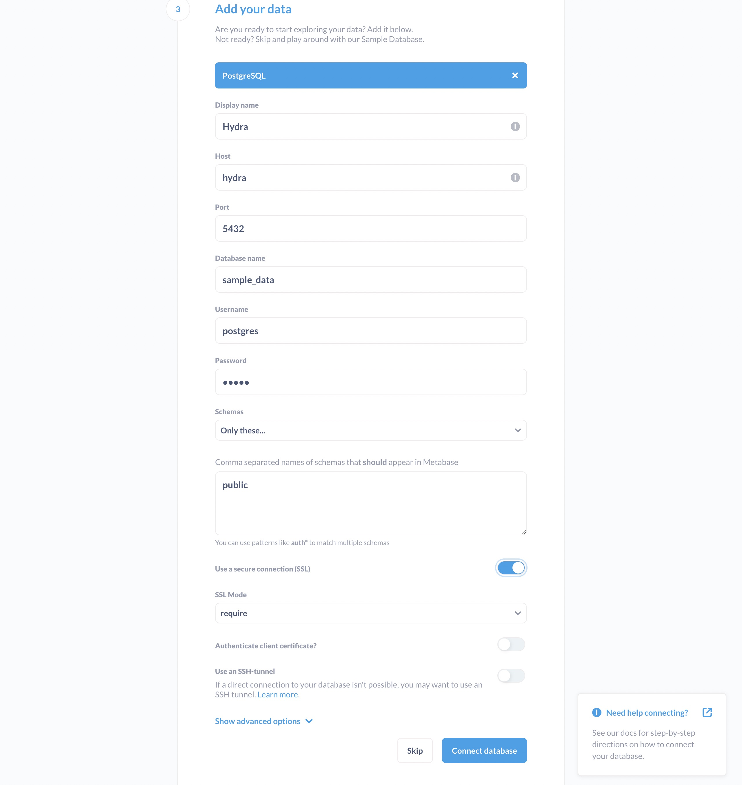
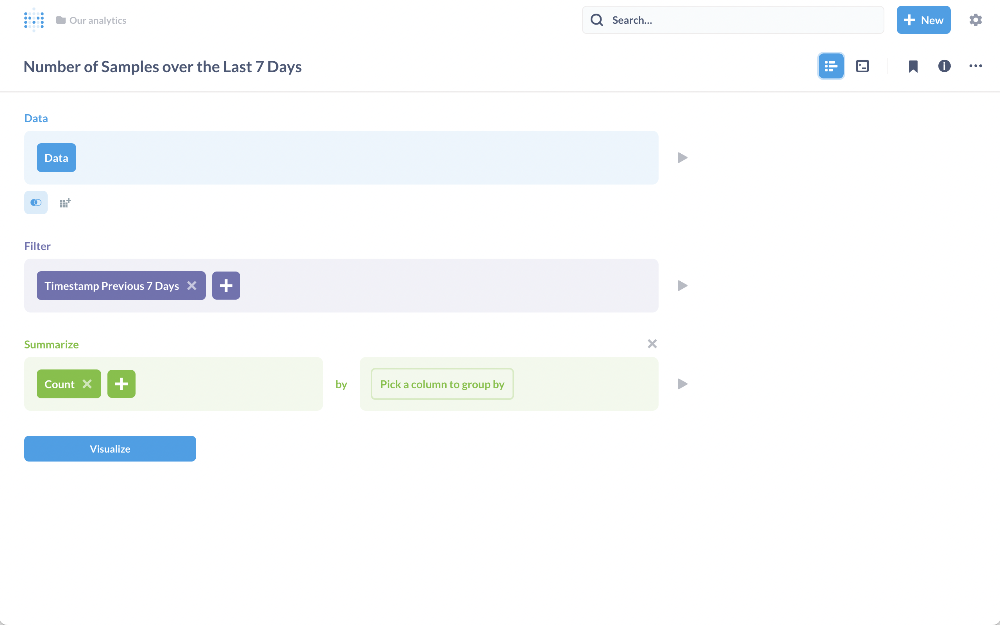
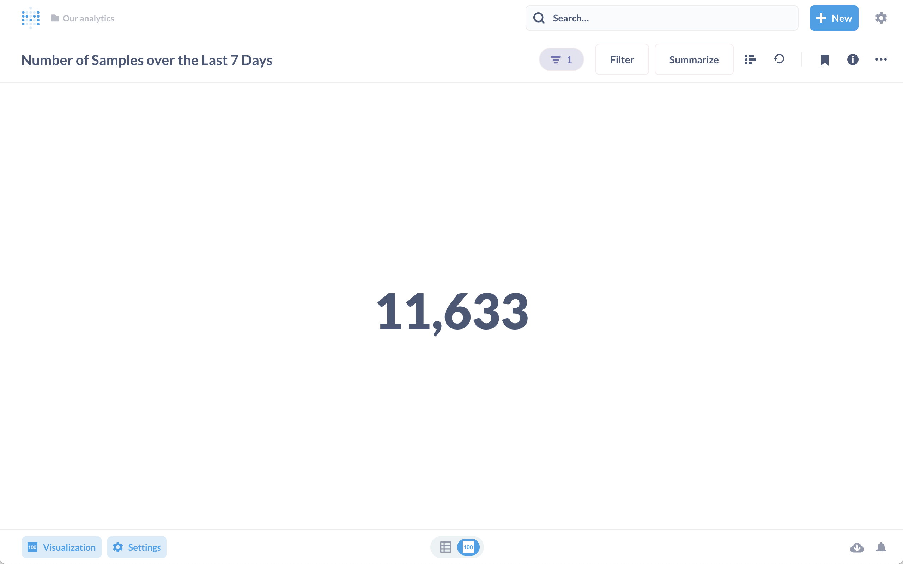
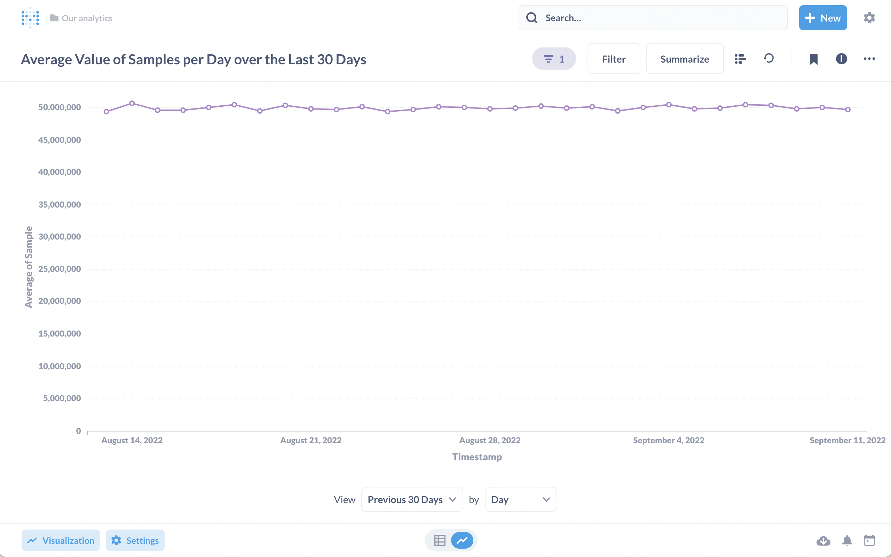
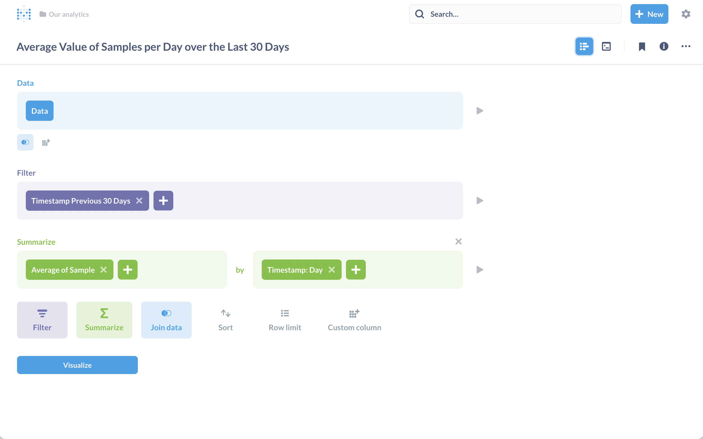
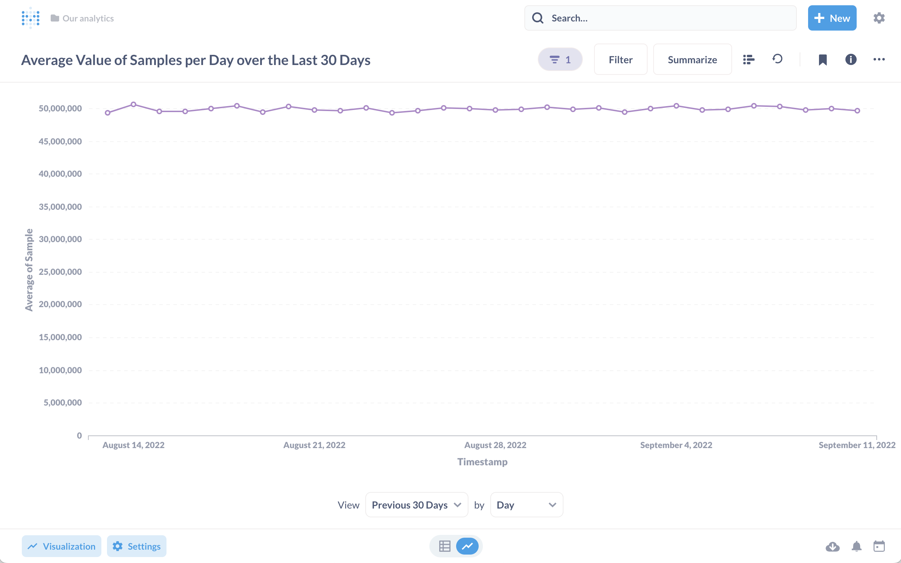
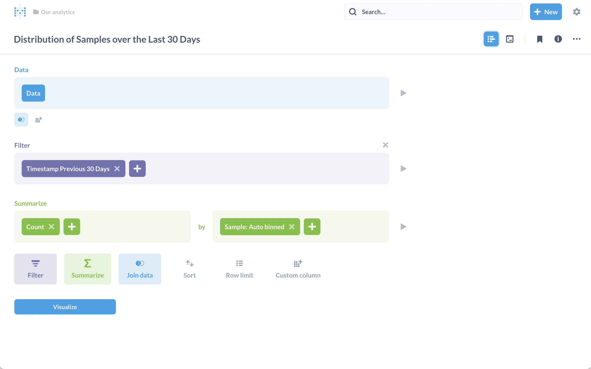
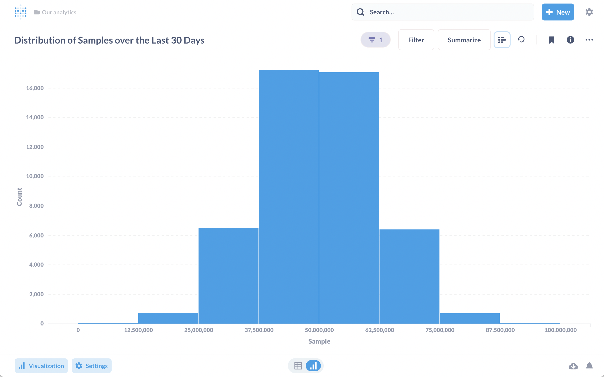
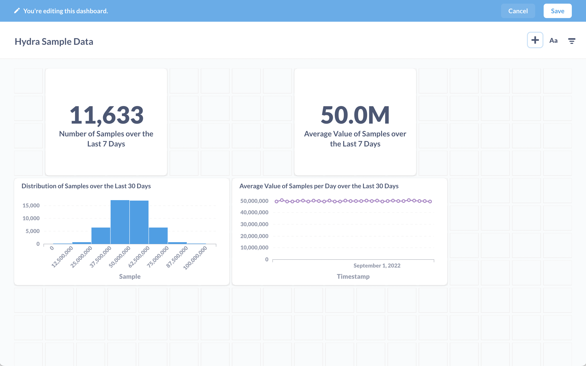
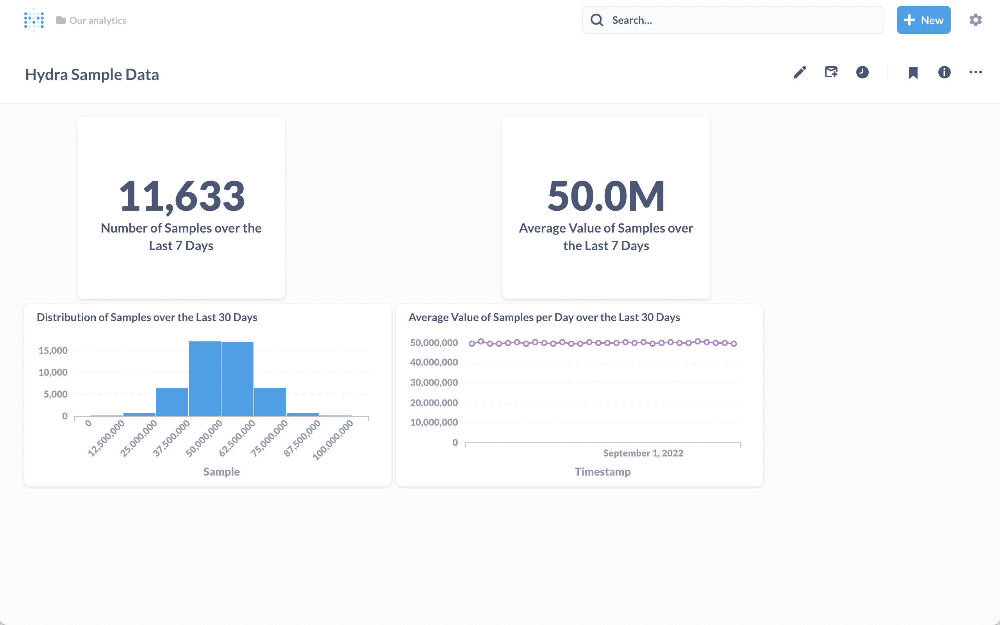

# With Metabase

As [Metabase](https://www.metabase.com/) puts it:

> **Business intelligence for everyone** Team doesn’t speak SQL? No problem. Metabase is the easy, open-source way to help everyone in your company work with data like an analyst.

## Setup

- Ensure you have the details of your Hydra instance handy.
- Sign up for [Metabase](https://www.metabase.com/).

### Seed some sample data

Let’s start by creating a sample table in Hydra and populate it with some data. You'll need to replace your Hydra connection string or set the `PGCONN` environment variable.

* Create a sample table and seed some data.

    ```shell
    psql "$PGCONN" \
      -c "CREATE TABLE sample_data (id uuid NOT NULL PRIMARY KEY DEFAULT gen_random_uuid(), sample integer, timestamp timestamptz) USING columnar;" \
      -c "INSERT INTO sample_data (sample, timestamp) SELECT floor((random() + random() + random() + random() + random() + random()) / 6 * 100000000)::int, to_timestamp(EXTRACT(epoch from NOW()) - floor(random() * 2600000)) FROM generate_series(1, 50000);"
    ```

We’ve created a table named `sample_data` with 50,000 random samples spread out over the last month.

#### Metabase first launch

Now we can configure Metabase to access our sample data in the Hydra.

* Head over to Metabase and log in.
* Add your Hydra instance as outlined in the below screenshot.



* Once you’ve landed at the Metabase dashboard you should see some options to view insights after a few seconds. Take some time to explore Metabase, for example “a glance at Data”

### Metabase: Queries, Questions and Dashboards

Now let’s combine the features of Metabase and Hydra to explore our sample data.

#### Queries

You can use Metabase to run ad hoc queries against Hydra. You can access it via New → SQL query.


```sql
SELECT
    MIN(sample), MAX(sample), COUNT(sample), AVG(sample), STDDEV(sample)
FROM sample_data;
```

For example we can run some summary statistics against our sample data using:


#### Questions

Metabase allows you to use questions to get answers from your data. Let’s create some questions now, that we’ll later turn into a dashboard. You can create questions via New → Question.

Let’s create four questions:

1.  Number of samples over the last 7 days

    

    
2.  Average values of samples over the last 7 days

    

    
3.  Average value of samples per day over the last 30 days

    

    
4.  Distribution of Samples over the last 30 days

    

    

#### Dashboards

Now let’s combine those questions into a dashboard to give our users at a glance access to these metrics.

1. Create a new dashboard via New → Dashboard
2. Add the four questions created above to the dashboard





#### Cleanup

Once you’re done exploring Metabase and Hydra you can cleanup the sample data be droping the `sample_data` table.

```shell
psql "$PGCONN" -c "DROP TABLE sample_data;"
```
